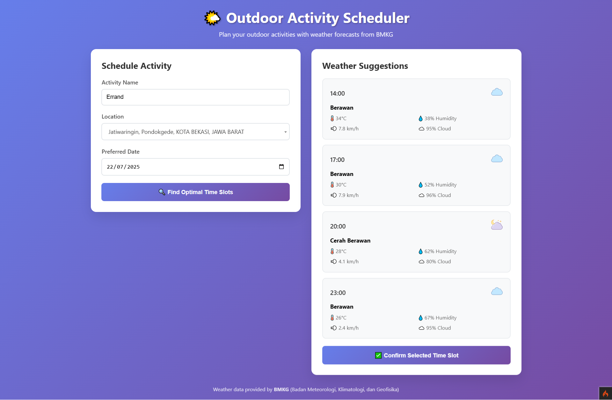

# 🌤️ Outdoor Activity Scheduler

A CodeIgniter 4 web application that helps you plan outdoor activities based on weather forecasts from BMKG (Badan Meteorologi, Klimatologi, dan Geofisika) Indonesia. The application analyzes weather forecasts to suggest optimal time slots with favorable weather conditions for your outdoor activities.

## 📸 Preview



## 📋 Features

### Frontend
- 📱 **Responsive Design**: Mobile-friendly interface with modern UI
- 🌤️ **Interactive Weather Display**: Real-time weather forecast visualization
- ⏰ **Smart Time Slot Selection**: Choose optimal times based on weather conditions
- ✨ **Modern Animations**: Smooth transitions and user interactions
- 🔍 **Location Search**: Intelligent search with Select2 integration

### Backend
- 🚀 **CodeIgniter 4**: Built with robust PHP framework
- 🌐 **BMKG API Integration**: Real-time weather data from Indonesian Meteorological Agency
- 💾 **Activity Management**: Create, view, update, and manage scheduled activities
- 🔍 **Smart Weather Filtering**: Automatically filters out unsuitable weather conditions (rain, storms)
- 📊 **Statistics Dashboard**: View activity statistics and weather summaries
- 🏛️ **RESTful API**: Complete API endpoints for all operations

## 🛠️ Tech Stack

- **Backend**: PHP 7.4.3, CodeIgniter 4
- **Database**: MariaDB 10.4.11
- **Frontend**: HTML5, CSS3, JavaScript (jQuery)
- **API Integration**: BMKG Weather Forecast API
- **UI Components**: Select2 for location search
- **Styling**: Custom CSS with gradient backgrounds and modern design principles

## 📦 Installation

### Prerequisites

- PHP 7.4.3 or higher
- Composer
- MariaDB 10.4.11 or MySQL 5.7+
- Web server (Apache/Nginx)

### Setup Steps

1. **Clone the repository**
   ```bash
   git clone <repository-url>
   cd outdoor-activity-scheduler
   ```

2. **Install dependencies**
   ```bash
   composer install
   ```

3. **Environment Configuration**
   ```bash
   cp env .env
   ```

4. **Configure database in `.env`**
   ```env
   database.default.hostname = localhost
   database.default.database = activity_scheduler
   database.default.username = root
   database.default.password = 
   database.default.DBDriver = MySQLi
   database.default.port = 3306
   ```

5. **Set application URL**
   ```env
   app.baseURL = 'http://localhost/outdoor-activity-scheduler/'
   CI_ENVIRONMENT = development
   ```

6. **Create database**
   ```sql
   CREATE DATABASE activity_scheduler;
   ```

7. **Run migrations**
   ```bash
   php spark migrate
   ```

8. **Set permissions** (Linux/Mac)
   ```bash
   chmod -R 777 writable/
   ```

9. **Start development server**
   ```bash
   php spark serve
   ```

   Or configure your web server to point to the `public/` directory.

## 🗄️ Database Schema

### Activities Table

| Column | Type | Description |
|--------|------|-------------|
| id | INT(11) | Primary key |
| activity_name | VARCHAR(255) | Name of the activity |
| location_code | VARCHAR(20) | BMKG location code |
| location_name | VARCHAR(255) | Human-readable location name |
| preferred_date | DATE | User's preferred date |
| selected_datetime | DATETIME | Final selected date and time |
| weather_condition | VARCHAR(100) | Weather condition (Indonesian) |
| weather_condition_en | VARCHAR(100) | Weather condition (English) |
| temperature | DECIMAL(5,2) | Temperature in Celsius |
| humidity | DECIMAL(5,2) | Humidity percentage |
| wind_speed | DECIMAL(6,2) | Wind speed in km/h |
| wind_direction | VARCHAR(3) | Wind direction |
| cloud_coverage | DECIMAL(5,2) | Cloud coverage percentage |
| visibility | VARCHAR(20) | Visibility range |
| status | ENUM | scheduled/completed/cancelled |
| notes | TEXT | Additional notes |
| created_at | DATETIME | Creation timestamp |
| updated_at | DATETIME | Last update timestamp |

## 🚀 API Endpoints

### Weather Endpoints
- `GET /api/weather?location={location_code}` - Get weather forecast for specific location
- `GET /api/locations` - Get available location options

### Activity Management
- `POST /api/activities` - Schedule new activity
- `GET /api/activities` - Get all scheduled activities
- `GET /api/activities/stats` - Get activity statistics
- `GET /api/activities/upcoming` - Get upcoming activities

## 🌐 BMKG API Integration

The application integrates with the BMKG (Indonesian Meteorological Agency) public weather forecast API:

- **Base URL**: `https://api.bmkg.go.id/publik/prakiraan-cuaca`
- **Coverage**: 3-day forecast with 8 predictions per day (every 3 hours)
- **Rate Limit**: 60 requests per minute per IP
- **Location Codes**: Uses Indonesian administrative code level IV from Ministry of Home Affairs
- **Format**: JSON with local timezone conversion (Asia/Jakarta)

### Weather Data Structure
```json
{
  "status": "success",
  "data": [
    {
      "utc_datetime": "2025-07-21 12:00:00",
      "local_datetime": "2025-07-21 19:00:00",
      "t": 28.5,
      "hu": 75,
      "weather_desc": "Berawan",
      "weather_desc_en": "Cloudy",
      "ws": 12,
      "wd": "NE",
      "tcc": 60,
      "vs_text": "> 10"
    }
  ],
  "source": "BMKG (Badan Meteorologi, Klimatologi, dan Geofisika)"
}
```

### Weather Filtering Logic

The application considers the following weather conditions suitable for outdoor activities:
- ✅ **Suitable**: Cerah (Clear), Berawan (Cloudy), Berawan Sebagian (Partly Cloudy)
- ❌ **Not Suitable**: Any condition containing rain, storms, or severe weather keywords

## 🌐 Usage

### Web Interface

1. **Access the application** at `http://localhost:8080` (or your configured URL)

2. **Schedule Activity**:
   - Enter activity name
   - Search and select location using intelligent search
   - Choose preferred date
   - Click "Find Optimal Time Slots"

3. **Select Time Slot**:
   - Review weather-based suggestions with detailed conditions
   - View temperature, humidity, wind speed, and visibility
   - Click on preferred time slot
   - Confirm selection with optional notes

### API Usage

**Schedule Activity Example:**
```javascript
fetch('/api/activities', {
    method: 'POST',
    headers: {
        'Content-Type': 'application/json'
    },
    body: JSON.stringify({
        activity_name: "Field Survey",
        location_code: "3171010001",
        location_name: "Jakarta Pusat - Gambir",
        preferred_date: "2025-07-22",
        selected_datetime: "2025-07-22 10:00:00",
        weather_condition: "Cerah",
        weather_condition_en: "Clear",
        temperature: 28,
        humidity: 65,
        wind_speed: 12,
        wind_direction: "NE",
        cloud_coverage: 20,
        visibility: "> 10"
    })
});
```

## ⚙️ Configuration

### Application Settings
```env
app.timezone = 'Asia/Jakarta'
CI_ENVIRONMENT = development
```

### BMKG API Settings
```env
bmkg.api.baseUrl = 'https://api.bmkg.go.id'
bmkg.api.timeout = 30
```

### Weather Cache Configuration
```env
weather.cache.duration = 1800  # 30 minutes
```

## 🔧 Customization

### Adding New Locations

Edit the `getLocationOptions()` method in `Controller/Activity.php`:

```php
$locations = [
    ['code' => 'LOCATION_CODE', 'name' => 'Location Name'],
    // Add more locations
];
```

### Weather Condition Filtering

Modify the weather filtering logic in the controller:

```php
$suitableConditions = ['cerah', 'clear', 'berawan', 'cloudy'];
$unsuitable_keywords = ['hujan', 'rain', 'storm', 'badai'];
```

### Styling Customization

Customize the appearance by editing `public/css/style.css`:
- Modern gradient backgrounds
- Responsive component styles
- Smooth animations and transitions
- Mobile-first design approach

## 🐛 Troubleshooting

### Common Issues

1. **Database Connection Error**
   - Check database credentials in `.env`
   - Ensure MariaDB/MySQL service is running
   - Verify database exists and user has proper permissions

2. **BMKG API Issues**
   - Check internet connection
   - API may have rate limits (60 requests/minute)
   - Application automatically falls back to cached data when API is unavailable

3. **Location Search Problems**
   - Verify location data is properly loaded
   - Check Select2 JavaScript library inclusion
   - Ensure proper AJAX endpoint configuration

4. **Static Files Not Loading**
   - Verify `app.baseURL` configuration in `.env`
   - Check web server document root settings
   - Clear browser cache and check developer console

### Debug Mode

Enable detailed debugging in `.env`:
```env
CI_ENVIRONMENT = development
logger.threshold = 4        # Debug level logging
app.CSRFProtection = false  # For API testing only
```

## 📁 File Structure

```
outdoor-activity-scheduler/
├── app/
│   ├── Controllers/
│   │   └── Activity.php          # Main API controller
│   ├── Models/
│   │   └── ActivityModel.php     # Activity data model
│   ├── Database/
│   │   └── Migrations/
│   │       └── CreateActivitiesTable.php
│   ├── Filters/
│   │   └── CORSFilter.php        # CORS handling
│   └── Config/
│       └── Routes.php            # API routes configuration
├── public/
│   ├── index.php                # Application entry point
│   ├── css/
│   │   └── style.css           # Custom styling
│   └── js/
│       └── app.js              # Frontend JavaScript
├── writable/                    # Logs and cache
├── .env                        # Environment configuration
├── composer.json              # PHP dependencies
└── README.md                  # Documentation
```

## 🤝 Contributing

1. Fork the repository
2. Create feature branch (`git checkout -b feature/AmazingFeature`)
3. Commit changes (`git commit -m 'Add AmazingFeature'`)
4. Push to branch (`git push origin feature/AmazingFeature`)
5. Open Pull Request

## 📄 License

This project is licensed under the MIT License - see the [LICENSE](LICENSE) file for details.

## 🙏 Acknowledgments

- **BMKG** - For providing comprehensive weather data API
- **CodeIgniter Team** - For the excellent PHP framework
- **Select2** - For the enhanced location search component
- **Indonesian Ministry of Home Affairs** - For location code standardization

## 📞 Support

For support and questions:
- Create an issue in the repository
- Check the [CodeIgniter 4 Documentation](https://codeigniter.com/user_guide/)
- Review BMKG API documentation for weather data specifications

---

**Made with ❤️ for better outdoor activity planning in Indonesia** 🇮🇩
